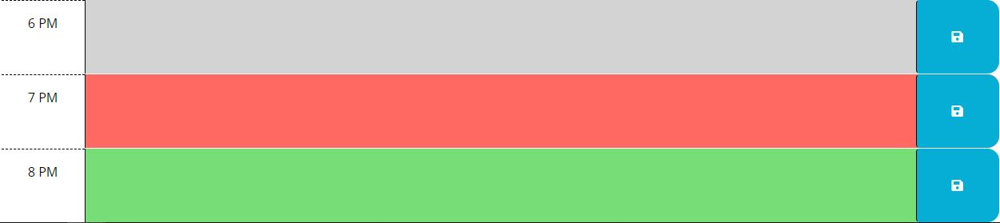
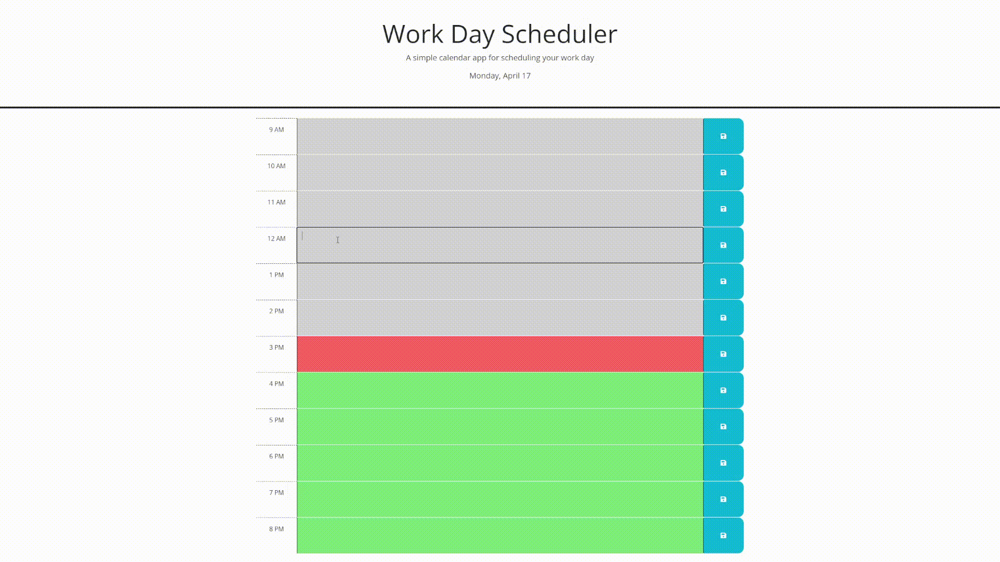

# Work_Day_Scheduler
05 Challenge Bootcamp

# Description
The goal of this project is to complete the daily planner app that allows users to create and manage schedules efficiently. The planner must have cards that represent every hour of the day as events, with color markers indicating the status of each event. Gray for past events, red for current events, and green for future events.

These cards will include a `<textarea>` where users can input their event plans, and a `<button>` on the right of the card to save the event.

## Acceptance Critetia
```
GIVEN I am using a daily planner to create a schedule
WHEN I open the planner
THEN the current day is displayed at the top of the calendar
WHEN I scroll down
THEN I am presented with timeblocks for standard business hours
WHEN I view the timeblocks for that day
THEN each timeblock is color coded to indicate whether it is in the past, present, or future
WHEN I click into a timeblock
THEN I can enter an event
WHEN I click the save button for that timeblock
THEN the text for that event is saved in local storage
WHEN I refresh the page
THEN the saved events persist
```
# Code Snippets
## General Information
Once the web page is opened, the main function will execute the code in the following order:

* Set the current date in the HTML, as well as set some global variable values to their corresponding values.
* Check for the current date in the local storage. If there isn't one, it will create an object array containing all the necessary information, such as time and text values, and save it in the local storage.
* Render the CardContainer in the HTML.


### JavaScript Code
```js
$(function () {

  doc_currentday.textContent = dayjs().format('dddd, MMMM D');
  actual_time = dayjs().format('HH');

  actual_date = dayjs().format('YYYYMMDD');

  hourArray = JSON.parse(localStorage.getItem(actual_date));

  if(hourArray==null){
    hourArray = [];

    for (var i = 0; i < day_length; i++) {

      let hour_info = {
        date:actual_date,
        time: i+day_start,
        text: ''
      };
    
    hourArray.push(hour_info);
    localStorage.setItem(actual_date, JSON.stringify(hourArray));
    }

  }
  console.log(hourArray);

  render_day();

});
```

## Card Container

```html
<div class="row time-block past" id="hour-9 AM"><div class="col-2 col-md-1 hour text-center py-3">9 AM</div>
    <textarea class="col-8 col-md-10 description" rows="3" size="image" id="textA-0"></textarea>
    <button class="btn saveBtn col-2 col-md-1" aria-label="save" type="submit" id="saveBtn-0">
        <i class="fas fa-save" aria-hidden="true"></i>
    </button>
</div>
```
### JavaScript Card Generator Script
To create the card content, the HTML structure of the original card is used and iterated n times using a for loop. 
* This loop creates a parent `<div>` and two child elements, `<textarea>` and `<button>`, with their corresponding class attributes and parameters.

* To validate the color marker of the card, an if-else statement is used. It evaluates if the card's time is less than, equal to, or greater than the current hour time, and assigns a class attribute to mark it correctly.

* Run a `for` loop to add the textarea `querySelector` to a textarea array and set the `on('click', function(){})` event listener to every button element.
```js
function render_day() {
  doc_hourlist.innerHTML="";
  
  for (var i = 0; i < day_length; i++) {

    var text_rem = hourArray[i].text;

    var HourItem = document.createElement('div');
    var new_i = day_start+i;
    var this_time;
    if(new_i<13){
      this_time = new_i + ' AM';
    }else{
      this_time = (new_i-12)+' PM';
    }
    if (new_i < actual_time) {
      HourItem.setAttribute('class', 'row time-block past');
    } else if (new_i == actual_time) {
      HourItem.setAttribute('class', 'row time-block present');
    } else {
      HourItem.setAttribute('class', 'row time-block future');
    }

    HourItem.setAttribute('id', 'hour-' + this_time);

    var content = document.createElement('div');
    content.setAttribute('class', 'col-2 col-md-1 hour text-center py-3');
    content.textContent = '' + this_time;

    var hour_textarea = document.createElement('textarea');
    hour_textarea.setAttribute('class', 'col-8 col-md-10 description');
    hour_textarea.setAttribute('rows', '3');
    hour_textarea.setAttribute('size', 'image');
    hour_textarea.setAttribute('id','textA-'+i);
    hour_textarea.textContent = text_rem;

    var saveBtn = document.createElement('button');
    saveBtn.setAttribute('class', 'btn saveBtn col-2 col-md-1');
    saveBtn.setAttribute('aria-label', 'save');
    saveBtn.setAttribute('type', 'submit');
    saveBtn.setAttribute('id', 'saveBtn-'+i);

    var item = document.createElement('i');
    item.setAttribute('class', 'fas fa-save');
    item.setAttribute('aria-hidden', 'true');
    
    saveBtn.appendChild(item);
    
    HourItem.appendChild(content);
    HourItem.appendChild(hour_textarea);
    HourItem.appendChild(saveBtn);

    doc_hourlist.appendChild(HourItem);
  }

  txt_Area = [];
  for (var i = 0; i < day_length; i++){
    txt_Area.push( document.querySelector("#textA-"+i));
    $('#saveBtn-'+i).on('click', function(event){saveData(event)});  
  }
  
}
```
## Save Data Function

### Save Data JavaScript Information
This is a function that is triggered when the event trigger in the save button is clicked occurs. The `event` object is passed as a parameter. 
* Using the event object all the id and necessary information is uset to set some local variable to properly get with button was pressed.
* The variable `new_text` is set by default to an empty string `('')`. It will be assigned the text from the textarea where the button was pressed. The function is wrapped in a `try{}catch{}` block because if the values from the textarea are null, the event will fail.
* Once the `new_text` is set, it will change the value in the global object array, and this updated array will be saved in the `localStorage` .
* The `render_day()` function will be called to re-render the `CardContainer` in the HTML, which will update the text on the page with the new data.
* The function `showAlert()` is called, which will make the "Correctly Saved" banner appear for 3 seconds. 

```js
function saveData(event){
  event.preventDefault();

  var btnId = event.target.id;
  var num = btnId.split('-');
  var timeId = num[1];
  var localhourArray = hourArray;
  var new_text = '';

  try{
    new_text = txt_Area[timeId].value.trim();    
  }catch{

  }
  
  console.log(new_text);

  localhourArray[timeId].text = new_text;
  localStorage.setItem(actual_date, JSON.stringify(localhourArray));

  render_day();
  showAlert();
}
```
### Saved Banner
```html
<svg xmlns="http://www.w3.org/2000/svg" style="display: none;">
      <symbol id="check-circle-fill" fill="currentColor" viewBox="0 0 16 16">
        <path d="M16 8A8 8 0 1 1 0 8a8 8 0 0 1 16 0zm-3.97-3.03a.75.75 0 0 0-1.08.022L7.477 9.417 5.384 7.323a.75.75 0 0 0-1.06 1.06L6.97 11.03a.75.75 0 0 0 1.079-.02l3.992-4.99a.75.75 0 0 0-.01-1.05z"/>
      </symbol>
    </svg>

    <div id="save_alert" style="display: none;" class="alert alert-success alert-dismissible fade show" role="alert">
      <svg class="bi flex-shrink-0 me-2" width="24" height="24" role="img" aria-label="Success:"><use xlink:href="#check-circle-fill"/></svg>
      <strong>Successfully Saved</strong>
    </div>
```
### Saved Banner JavaScript Code
```js

function showAlert(){
  doc_alert.setAttribute('style','display:flex;');
  var timelimit = 2;
  var interval = setInterval(function(){
    if(timelimit>0){
      timelimit--;
    }else{
      doc_alert.setAttribute('style','display:none;');
      clearInterval(interval);
    }
  },1000);
}
```
# Video

# Pages Link
Website Link [Github Pages Link](https://santis1001.github.io/Work_Day_Scheduler/)
